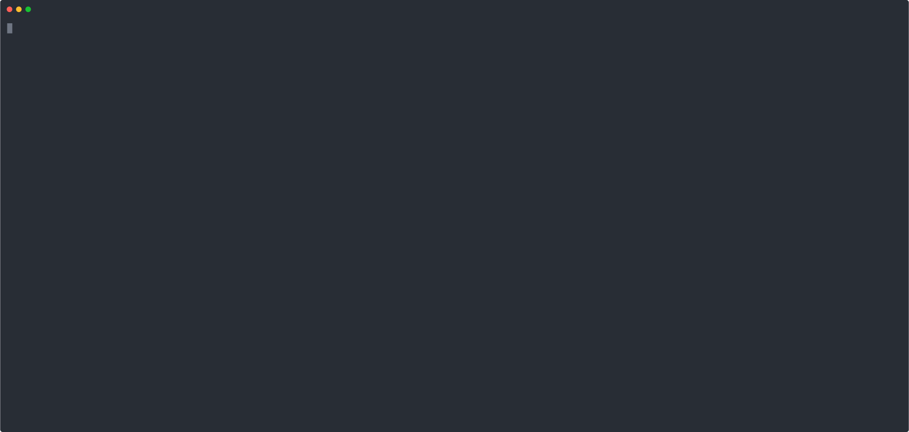

# Groovy 4 Examples

<p align="center">
  
</p>

## Install the latest Groovy

```bash
sdk install groovy
```

Get SDKMAN - https://sdkman.io/

## Run a single script with `groovy` command

```bash
cd examples/

groovy 01_basic_switch_expressions.groovy
```

## Run a single script using Gradle

```bash
./gradlew -q runScript -PmainClass=01_basic_switch_expressions
```

## Run all scripts using Gradle

```bash
chmod +x ./runall.sh

./runall.sh
```
